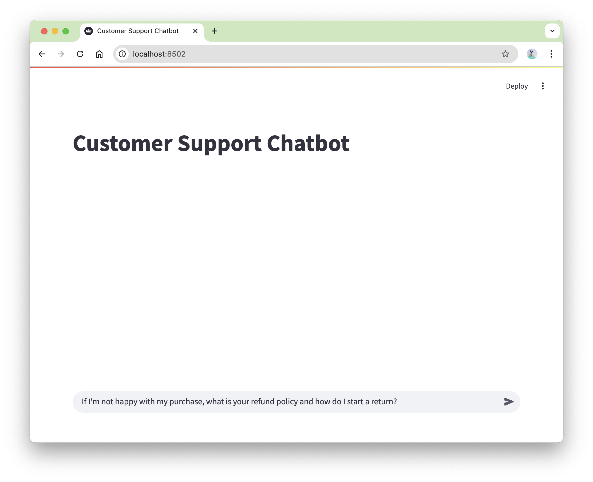
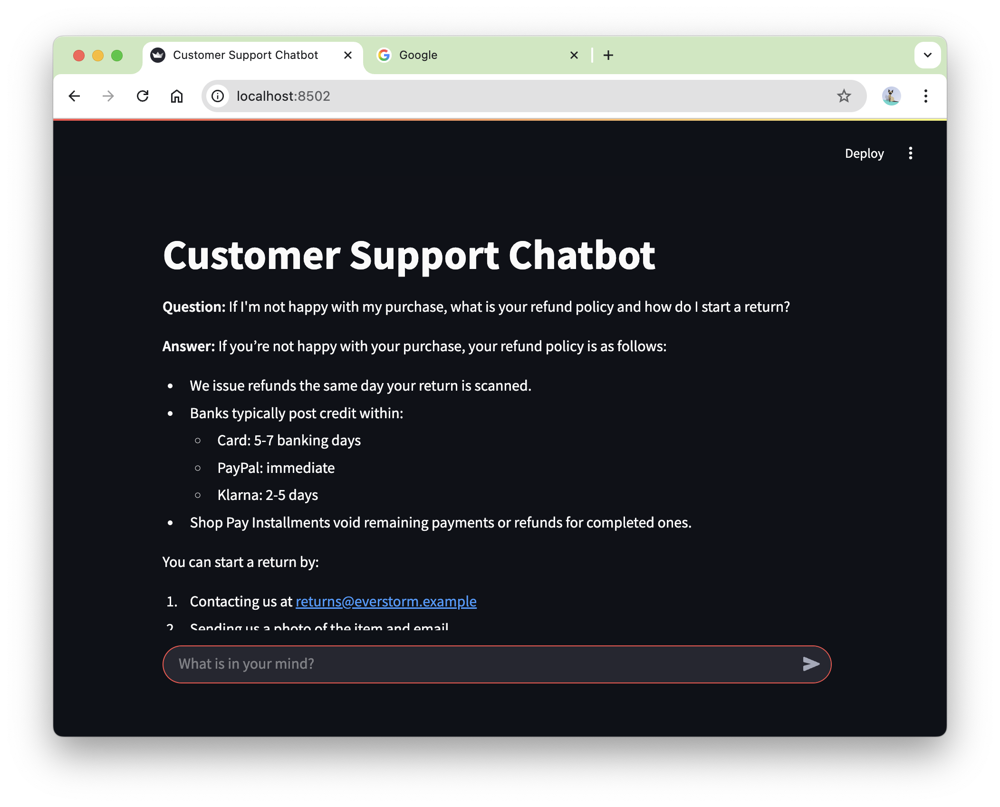

# rag-chatbot


## Environment Setup 

```bash
conda env create -f environment.yml 
conda activate rag-chatbot
```

## Preparing the source documents and retriver

```python
python prepare.py
```

**Explaination:**

This part is to provide the context for the chatbot. 

1. Load every PDF whose filename matches `data/Everstorm_*.pdf` 
    - package: `PyPDFLoader` by LongChain
2. Split large documents into smaller, overlapping chunks. 
    - package: `RecursiveCharacterTextSplitter` by LongChain
    - choice: chunks is set to be 300 tokens with a 30-token overlap.
3. Convert each document chunk into a embedding that captures its semantic meaning.
    - tool:  `SentenceTransformerEmbeddings` by LongChain
    - model choice: `gte-small` (77 M parameters). Other choice can be OpenAI’s `text-embedding-3-small`, etc
4. Build a vector database to store and search embeddings more efficiently
    - tool: `FAISS`. [FAISS Quickstart](https://github.com/facebookresearch/faiss/wiki/getting-started)
    - choice: Top k query, k = 8


## Load the generation engine (Ollama, Gemma3-1B)

Follow these steps to set up Ollama and start the model server:

**1 - Install**
```bash
# macOS (Homebrew)
brew install ollama
# Linux
curl -fsSL https://ollama.com/install.sh | sh
```

If you’re on Windows, install using the official installer from https://ollama.com/download.

**2 - Start the Ollama server (keep this terminal open)**
```bash
ollama serve
```
This command launches a local server at http://localhost:11434, which will stay running in the background.


**3 - Pull the Gemma mode (or the model of your choice) in a new terminal**
```bash
ollama pull gemma3:1b
```

**Explaination:**
* This part is to allow our current code to generate responses locally using the Gemma model through the Ollama API. The retriever finds relevant information, and the LLM uses that information to generate coherent, context-aware responses.
* [Ollama](https://github.com/ollama/ollama) is a lightweight runtime for managing and serving open-weight LLMs locally. [Link to All supported models](https://ollama.com/library)


## Run the chatbot
```python
streamlit run app.py
```

Initiate a UI interface to ask questions.



